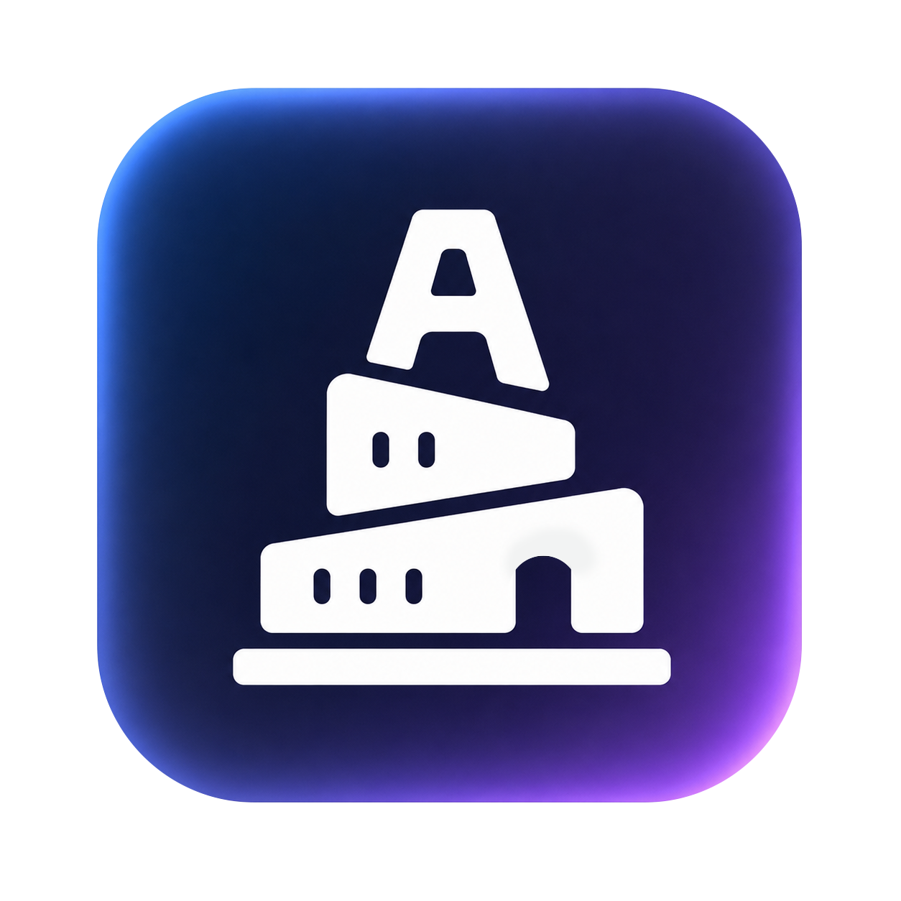
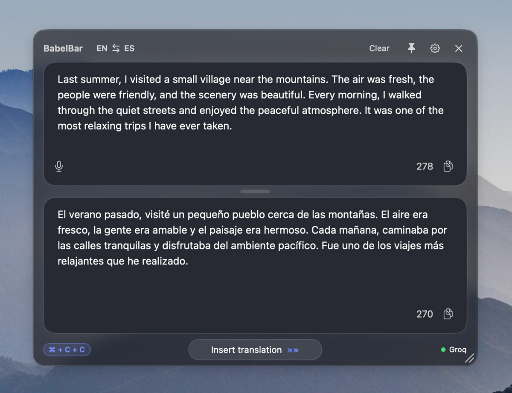
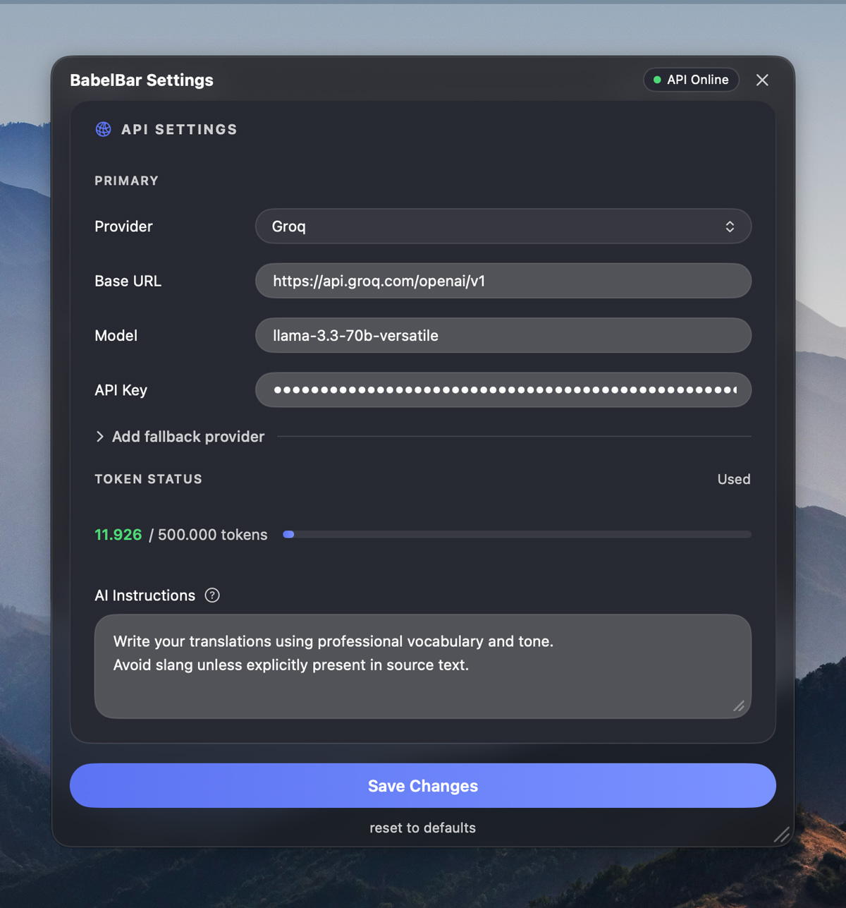
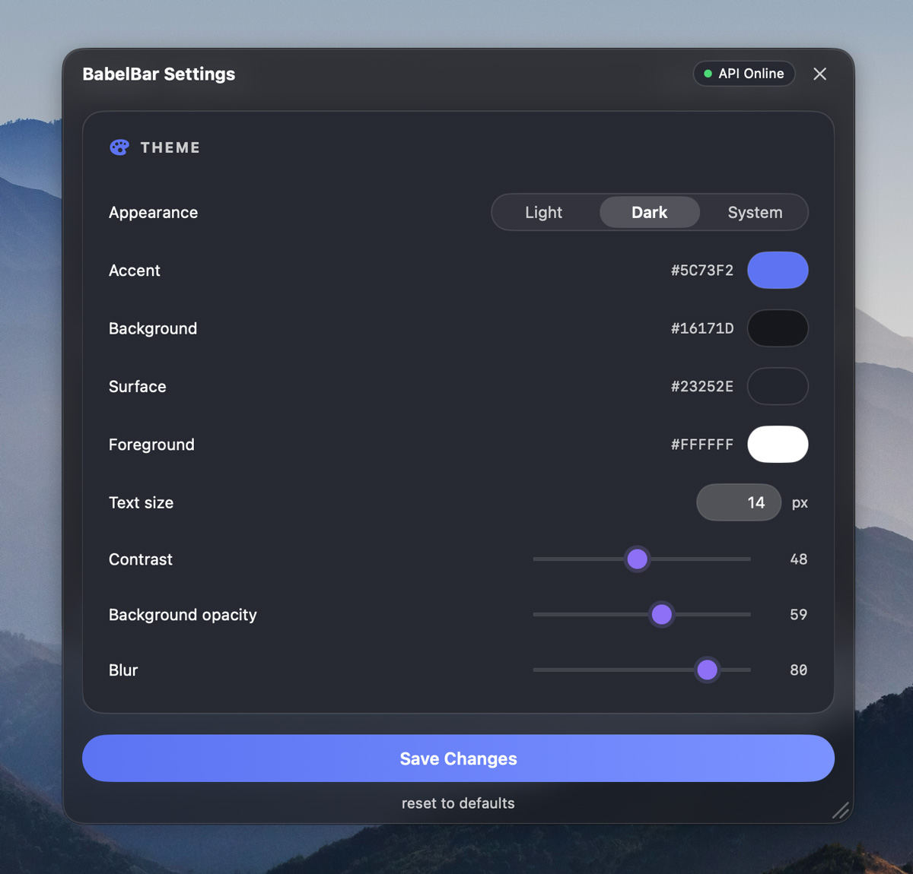
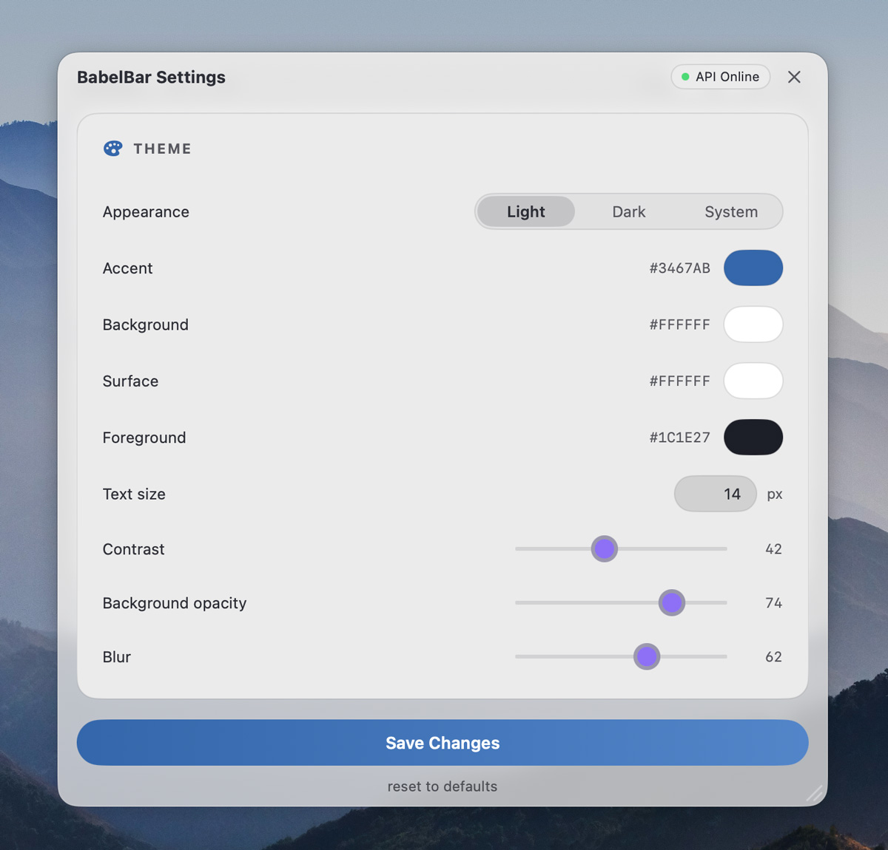
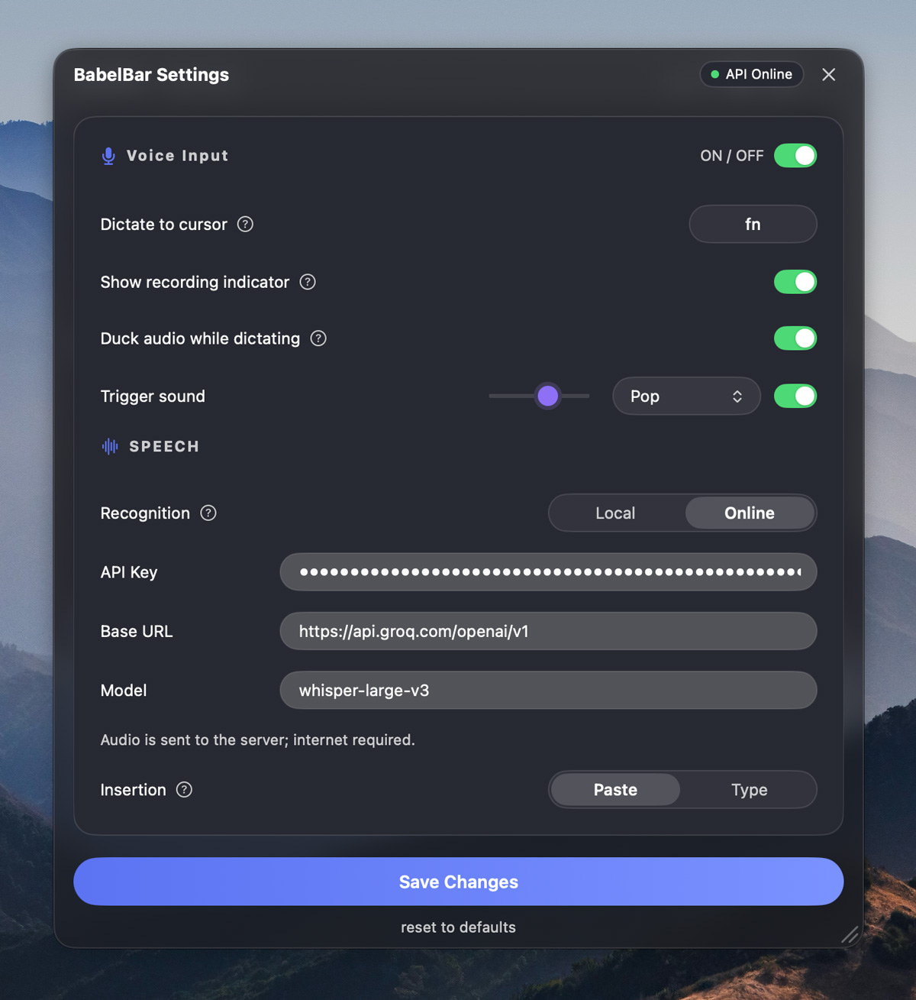
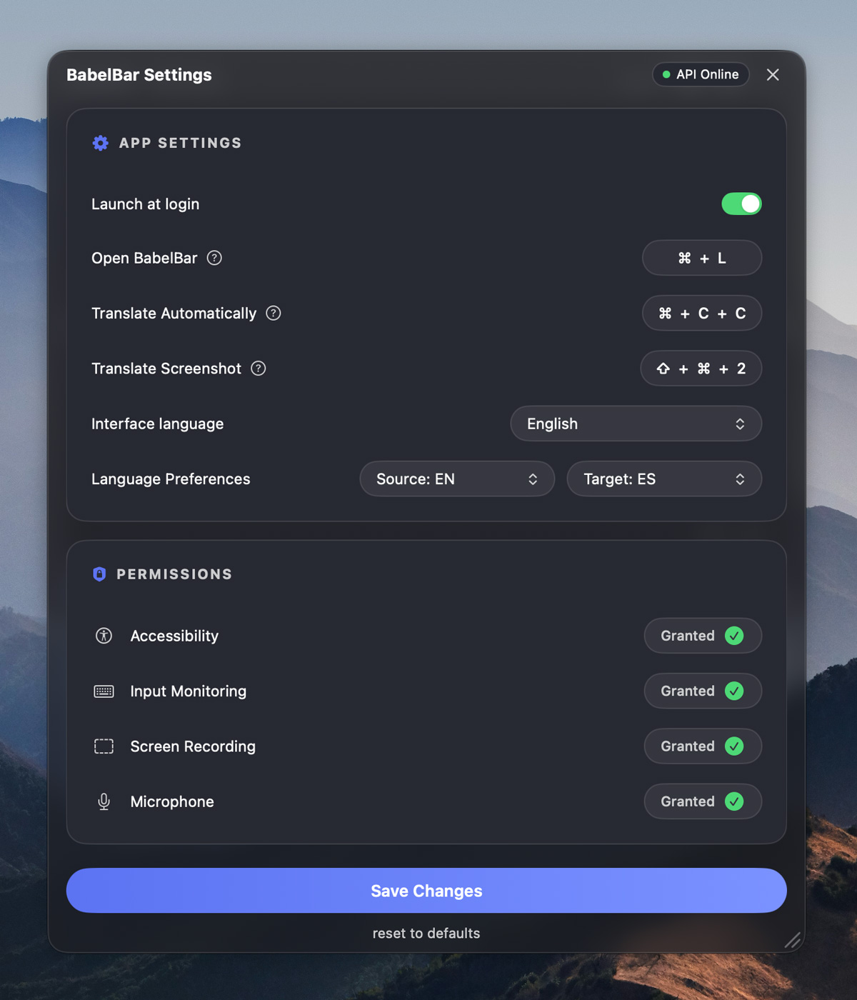

  

<h1 align="center">BabelBar</h1>

  <b>Translate anything on your Mac. Instantly.</b> 
  A lightweight menu-bar translator with hotkeys, OCR, voice dictation, themes, and zero subscriptions.

  
  
  
  

---

### Translate any selection — ⌘C+C

  

Select text in any app, double-tap Copy — translation appears instantly. Edit either side, press Enter — the other updates live. Works with any language pair.

---

### Your provider, your key

  

OpenAI · DeepSeek · Claude · z.ai · Groq — or any OpenAI-compatible endpoint. Add a fallback provider for automatic failover. Custom AI instructions let you control translation tone and style. Your data goes directly to your provider — we don't proxy, store, or see anything.

---

### Fully themeable — dark & light

  
  &nbsp;&nbsp;
  

Colors, blur, contrast, opacity, text size — tune everything to match your desktop. Independent dark and light palettes with one-click switching.

---

### Voice dictation & speech recognition

  

Hold **Fn**, speak, release — recognized text types directly at your cursor. **⇧Fn** for instant voice-to-translation. Local (WhisperKit, on-device) or online (Groq Whisper) recognition. Audio ducking automatically lowers system volume while you dictate.

---

### App settings & permissions

  

Customizable hotkeys, launch at login, multilingual interface (EN/RU), screenshot OCR — all from one clean settings panel. Clear permission status so you always know what's granted.

---

## How it works

1. **Install & grant permissions** — Accessibility, Input Monitoring, Screen Recording, Microphone.
2. **Add your API key** — from OpenAI, DeepSeek, Claude, z.ai, Groq, or any OpenAI-compatible provider.
3. **Translate anywhere** — select text, press **⌘C+C**, get the translation instantly.

## Features at a glance

| | Feature | Description |
|---|---|---|
| **⌘C+C** | **Translate selection** | Select text in any app, double-tap Copy — translation appears instantly |
| **↩** | **Two-way editing** | Edit the translation, press Enter — get reverse translation |
| **⇧⌘2** | **Screenshot OCR** | Translate text from any area of your screen |
| **Fn** | **Voice dictation** | Hold Fn, speak, release — recognized text types at your cursor |
| **⇧Fn** | **Voice → Translate** | Speak in one language, get the translation in another |
| **🔇** | **Audio ducking** | System volume lowers during dictation so speakers don't bleed into the mic |
| **🎨** | **Fully themeable** | Colors, blur, contrast, opacity — dark & light themes |
| **🔑** | **BYOK** | OpenAI · DeepSeek · Claude · z.ai · Groq · auto-fallback to a backup key |
| **🔒** | **Private** | All data goes directly from you to your AI provider |

## System requirements

- macOS 13.0 (Ventura) or later
- Your own API key from a supported provider (DeepSeek is recommended — fast and very cheap)

## Installation

1. Download the latest **[BabelBar.dmg](https://github.com/Clleo/BabelBar/releases/latest)** from Releases.
2. Open the DMG, drag **BabelBar** into **Applications**.
3. Launch BabelBar — it appears in your menu bar.
4. Open Settings, paste your API key, and you're good to go.

## Support the project

BabelBar is free and always will be. If you find it useful, you can support development:

- ☕ **Buy a Coffee** — $5
- 🚀 **Support Development** — $12

<!-- Uncomment when donation page is live:
[Support BabelBar →](https://babelbar.app/support)
-->

## FAQ

**Is BabelBar free?**
Yes. Support is completely optional.

**Do I need a subscription?**
No. There are no subscriptions or hidden fees.

**Do I need an API key?**
Yes. You need your own API key from a supported provider. DeepSeek is very cheap — just a few cents per month for typical use.

**What permissions does the app need and why?**
Accessibility (to read selected text), Input Monitoring (for hotkeys), Screen Recording (for OCR). Your data stays on your Mac.

**Where is my data?**
Your data stays with you. Translations are sent directly to your provider — we never store anything.

---

  © 2025 BabelBar. All rights reserved.

